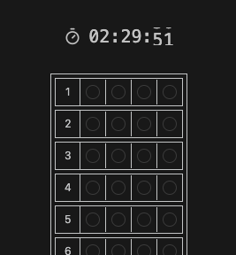

# OMR Extension

> [!NOTE]  
> PDF 형식의 시험지를 웹에서 OMR 형태의 인터페이스로 풀 수 있도록 도와주는 크롬 확장 프로그램입니다.

 

## 설치 및 실행

> [!WARNING]  
> 현재 크롬 웹 스토어에 게시되어 있지 않습니다. 이로 인해 레포지토리 클론을 통해 활용 가능합니다.
> 추후 게시 예정은 아직 없습니다.

1. 레포지토리 클론을 진행하고 `npm run build` 명령어를 통해 빌드를 진행합니다.
2. 이후 [압축 해제된 익스텐션을 로드](https://developer.chrome.com/docs/extensions/get-started/tutorial/hello-world?hl=ko#load-unpacked)하여 개발자 모드로 활용할 수 있습니다.
3. 로드가 완료되었으면 익스텐션 활성화를 진행하고, 익스텐션 아이콘을 클릭해 프로그램을 실행할 수 있습니다.

## 활용 가이드

### OMR 옵션 선택하기

첫 번째 화면에서 시험 유형에 따른 옵션을 선택할 수 있습니다. 각 옵션에 대한 설명은 각각 다음과 같습니다.

- Time Limit: 응시 시간
- Number of Questions: 총 문제 개수
- Number of Answers: 문제 당 답안 개수
- Number of Questions per Category: 카테고리 당 문제 개수
  - 카테고리는 문제를 묶는 단위에 해당하며, 예를 들어 과목과 같습니다.
- Save as default: 해당 설정을 기본 설정으로 지정하며, 익스텐션을 실행할 때 해당 설정값이 기본값으로 입력됩니다.

이후 "Start" 버튼을 클릭하여 풀이를 진행할 수 있습니다.
 
 

### 풀이 진행하기

- 풀이가 시작되면 OMR 인터페이스와 함께 타이머가 등장합니다. 타이머는 정지, 시작, 초기화가 가능하며 타이머 시간이 초과되더라도 풀이가 종료되지 않습니다.
- 풀이는 마우스 클릭 혹은 첫 번째 답을 마우스로 입력한 뒤 탭과 방향키를 통해 진행할 수 있습니다.
- 모든 답을 입력한 뒤 화면 최하단의 버튼을 입력하거나 OMR 인터페이스에 Focus가 된 상태로 엔터를 클릭하면 모든 답안을 텍스트 형태로 복사할 수 있습니다. 

 

## 유의사항

- 답안 저장 기능은 별도로 존재하지 않으며, 익스텐션을 종료하는 경우 입력했던 답안은 모두 사라집니다.
